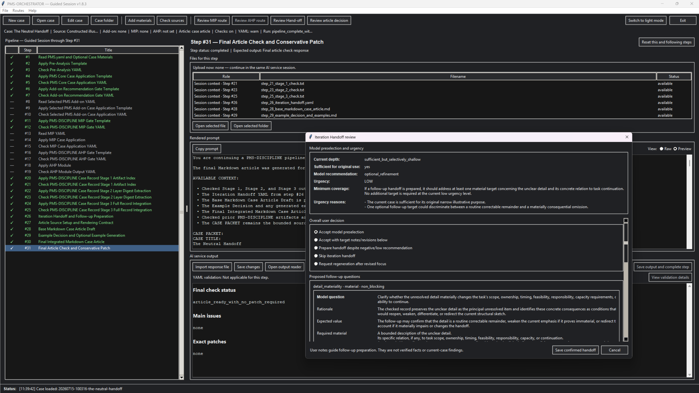

# PMS-ORCHESTRATOR Technical Documentation

This document contains the detailed implementation, storage, validation, interface, and operational notes split out from the main README. The public link and citation sections remain in `README.md`.

---

# PMS-ORCHESTRATOR

## A Human-Guided Runner for PMS-DISCIPLINE Case Work

**PMS-ORCHESTRATOR** is a service-independent desktop application for running structured PMS-DISCIPLINE case sessions step by step.

The application does not connect to an AI service, does not make autonomous route decisions, and does not treat generated output or supplied files as evidence merely because they are present. It prepares the current prompt, shows the files required for that step, stores the raw response, applies deterministic local YAML checks where configured, and keeps the human user in control of every consequential branch.

Its operating principle is:

> Structure the workflow, preserve the record, expose drift, and keep decisions human-confirmed.

---



---

## What the Application Does

PMS-ORCHESTRATOR guides a case through a bounded analytical and article-generation pipeline:

```text
PMS Base and optional case materials
→ Pre-Analysis
→ PMS Core
→ optional PMS add-on
→ optional MIP
→ optional AHP
→ Case Record Stages 1–3
→ optional Iteration Handoff
→ optional Markdown article and/or separately bounded follow-up preparation
```

The runner supports:

- one active step at a time;
- exact prompt rendering from the internal prompt resource;
- case creation and editing with multiline source-status and intended-use fields;
- case-specific supporting materials;
- temporary material selection while a new case is being created;
- file lists for the current step;
- manual copy to an external AI service;
- manual paste or import of the response;
- raw output preservation;
- resumable cases;
- human-confirmed Add-on, MIP, AHP, and article routes;
- user-reviewed Iteration Handoff with urgency, notes, and follow-up targets;
- optional semantic AI review steps;
- deterministic local YAML validation;
- persisted validation reports and finding handoffs;
- reset and route-revision archives;
- material-revision archives;
- Markdown preview;
- a maximized output reader;
- source and template availability checks;
- source and template downloads from one editable manifest;
- consistent light and dark themes across the main window and dialogs.

---

## Design Principles

### Human control

The application never selects a consequential route by itself.

Gate outputs may preselect a route, but the user confirms or overrides:

- the selected PMS add-on;
- MIP use or non-use;
- AHP use or non-use;
- optional article generation.

The runner also does not infer that a supplied material is true, relevant, complete, or evidentiary merely because it was attached to a case.

### Service independence

The runner has no built-in AI provider connection.

The user:

1. copies the rendered prompt;
2. uploads the listed files to an AI service;
3. pastes or imports the response;
4. reviews and completes the step.

No API key is required.

### Raw-output preservation

Responses are stored as received. The application does not silently rewrite model output.

Corrections remain visible through:

- review-step outputs;
- local validation reports;
- route records;
- reset archives;
- material-revision archives;
- case history.

### Structural validation without semantic authority

Local YAML validation checks structure, not meaning.

It can detect:

- invalid YAML;
- duplicate keys;
- missing keys;
- unexpected keys;
- mapping/list shape mismatches;
- basic type mismatches;
- explicitly allowed values.

It does not determine whether an interpretation, claim, route, score, boundary, or conclusion is correct.

### Visible and correctable drift

The runner does not assume that model drift can be eliminated.

Instead, it keeps drift:

- visible;
- bounded;
- persisted;
- transferable to the next relevant prompt;
- correctable without erasing provenance.

A green check indicates completion without unresolved local YAML findings. A yellow check indicates completion with findings retained in the record.

### Materials remain bounded input

Case materials may inform the case, but their presence does not upgrade their status.

A material is not automatically:

- PMS Base;
- a PMS add-on;
- MIP or AHP;
- a template;
- validation;
- a checked artifact;
- evidence;
- proof of a claim.

Descriptions and purposes entered by the user are orientation metadata. They are not independent evidence or validation.

---

## Implemented Pipeline

The guided workflow contains 31 steps.

### PMS Base, case materials, and Core

```text
#1  Read PMS.yaml and Optional Case Materials
#2  Apply Pre-Analysis Template
#3  Check Pre-Analysis YAML
#4  Apply PMS Core Case Application Template
#5  Check PMS Core Case Application YAML
```

Step #1 always reads `PMS.yaml` first. Configured case materials are then read where accessible. Case analysis does not begin during this reading step.

### PMS add-on routing and application

```text
#6  Apply Add-on Recommendation Gate Template
#7  Check Add-on Recommendation Gate YAML
#8  Read Selected PMS Add-on YAML
#9  Apply Selected PMS Add-on Case Application Template
#10 Check Selected PMS Add-on Case Application YAML
```

Supported add-on families:

```text
ANTICIPATION
CRITIQUE
CONFLICT
LOGIC
EDEN
SEX
```

Exactly zero or one add-on is applied in a run.

### MIP and AHP

```text
#11 Apply PMS-DISCIPLINE MIP Gate Template
#12 Check MIP Gate YAML
#13 Read MIP YAML
#14 Apply MIP Case Application
#15 Check MIP Case Application YAML
#16 Apply PMS-DISCIPLINE AHP Gate Template
#17 Check AHP Gate YAML
#18 Apply AHP Module
#19 Check AHP Module Output YAML
```

MIP is a downstream non-add-on layer.

AHP is available only after an actual checked MIP branch. It is a second-order analysis-quality overlay and does not rescore MIP, activate D, upgrade evidence, or authorize stronger claims.

### Case Record

```text
#20 Apply PMS-DISCIPLINE Case Record Stage 1 Artifact Index
#21 Check Stage 1 Artifact Index
#22 Apply Stage 2 Layer Digest Extraction
#23 Check Stage 2
#24 Apply Stage 3 Full Record Integration
#25 Check Stage 3
```

The Case Record pipeline separates:

- upstream artifact and route inventory;
- layer-level digest extraction;
- full-record integration.

Stage 1 receives a runner-generated manifest containing the resources selected or used for the current run, the produced or skipped upstream artifacts, the confirmed routes, and the case-material inventory.

It does not reproduce the complete local source installation merely because files are present. Unselected add-ons, MIP, and AHP remain visible through their route state without being represented as selected, read, applied, or produced.

Stage 1 indexes upstream workflow artifacts only. Its own current output is runner execution metadata and is not required to appear inside its own artifact inventory.

The same current-step boundary applies to Stages 2 and 3. A step must not convert its own temporary output-existence state into:

- a missing artifact;
- a deferred artifact;
- a deliberately excluded item;
- a workflow tension;
- a case finding;
- a readiness blocker.

Stage 2 extracts compact layer digests without changing the checked analysis. PMS operator identity, canonical name, definition-level function, dependency status, analytic weight, and checked case-specific role must remain stable during compression.

Stage 3 integrates the checked Stage 1 and Stage 2 records without creating new substantive analysis or repurposing PMS operators.

### Iteration Handoff and optional Markdown article

After checked Case Record Stage 3, the runner performs a lightweight Iteration Handoff step before the article route.

```text
#26 Iteration Handoff and Follow-up Preparation
#27 Article Source Setup and Rendering Contract
#28 Base Markdown Case Article Draft
#29 Example Decision and Optional Example Generation
#30 Final Integrated Markdown Case Article
#31 Final Article Check and Conservative Patch
```

Step #26 is not Case Record Stage 4. It derives a prospective model preselection from checked Stages 1–3: current analytical depth, sufficiency for the original intended use, iteration value, urgency, candidate follow-up targets, and material needed for a separately bounded follow-up case. It must not create new findings, preselect add-ons, inherit claim authority, or treat prior analysis as evidence.

Before step #26 is completed, the runner opens a user-review window for the Iteration Handoff. The window shows the model preselection, urgency level, reasons, urgency-raising and urgency-lowering factors, and the urgency-dependent minimum coverage requirement. Each proposed follow-up target can be accepted, refined, replaced, split, merged, rejected, or annotated. The user may also add follow-up questions, general case notes, chronology or trajectory notes, and material-location notes. The saved YAML preserves three layers separately: the model proposal, the user response, and the effective follow-up target.

User notes guide future follow-up preparation but do not become verified facts, current-case findings, evidence, operator activations, Add-on/MIP/AHP preselection, or confirmation of the prior analysis.

A confirmed Iteration Handoff may be used in two controlled ways:

1. The article prompts may render a bounded `Iteration outlook` section when the handoff explicitly permits it. The section remains prospective and must not change the current case result, claim ceiling, operator status, route state, source status, or sufficiency assessment. Raw user notes appear only when their per-target article visibility is `summarize` or `include`; the default is `exclude`.
2. The user may create a separately bounded follow-up case from the handoff through the contextual action dialog shown after step #26 completes. The same dialog can be reopened later through the toolbar or Routes-menu **Review Hand-off** action without resetting step #26 or replacing the saved YAML. The new case receives parent-case lineage, the approved effective targets, required-material notes, and selected prior artifacts as analytical context. The new case starts again at step #1 and must confirm its own boundary, source status, intended use, and material roles. It does not inherit findings, routes, evidence status, or claim authority.

When article generation is selected, the user chooses one of two presentation profiles.

#### Case article

A focused, standalone article centered on the case-specific analysis.

This profile:

- preserves the main structural movement;
- preserves active-layer contributions;
- preserves relevant rivals, limits, weakening conditions, and reopening conditions;
- uses Stage 1 primarily for provenance control rather than visible audit narration;
- groups weak, conditional, dependency-limited, inactive, or analytic-only operators where possible;
- avoids separate operator sections merely to show that every operator was considered;
- mentions inactive add-ons, MIP, or AHP only when their non-use prevents a case-specific false trigger or materially explains the result;
- normally limits the case-specific boundary to the misuse or escalation risks nearest to the material and actual analysis;
- omits generic workflow history, repeated non-authority language, inactive-layer inventories, and remote boundary catalogues.

#### Full analysis article

A detailed, audit-rich narrative rendering of the complete checked analysis record.

This profile may preserve:

- provenance and source-chain detail;
- route and branch decisions;
- fuller operator calibration;
- layer interaction;
- checked non-use records;
- extended claim and misuse boundaries;
- unresolved tensions;
- weakening and reopening conditions;
- report-readiness context.

The full profile remains subject to the same non-authority and anti-repetition rules. A detailed article must not repeat the same provenance fact, route decision, claim boundary, or warning across several sections merely because it appears in several source artifacts.

### Operator fidelity in articles

Article prompts preserve the canonical PMS operator names:

```text
Δ (Difference)
∇ (Impulse)
□ (Frame)
Λ (Non-Event)
Α (Attractor)
Ω (Asymmetry)
Θ (Temporality)
Φ (Recontextualization)
Χ (Distance)
Σ (Integration)
Ψ (Self-Binding)
```

In article prose, the first occurrence of an operator in each paragraph is followed by its canonical English name in parentheses. Later occurrences in the same paragraph may use the symbol alone. Symbolic formulas may remain symbol-only.

A case-specific explanation may follow the canonical name, but it must not replace or redefine the operator.

When step #29 returns an unambiguous no-example decision, the runner copies the base article to the final-article path without an unnecessary rewrite. The final conservative review remains available when semantic review steps are enabled and applies the selected article profile as part of its review contract.

---

## Case Materials

PMS-ORCHESTRATOR supports case-specific supporting material such as:

```text
ZIP document packages
PDF and DOCX documents
Markdown and plain-text notes
CSV and spreadsheet files
JSON and YAML data
articles, reports, statistics, and tables
images
other user-selected files
```

ZIP is recommended when several related files belong together.

### Adding materials

Materials can be added from:

- `Add materials…` while creating a new case;
- `Add materials…` in the Edit Case dialog;
- `Add materials` in the main toolbar.

The button in the New Case dialog is available immediately. A title does not have to be entered before files can be selected.

The material manager supports multiple file selection. For each material, the user can enter:

- a description of its contents;
- its purpose in the case.

Duplicate filenames are handled safely. A later file does not silently overwrite an existing material with the same name.

### Materials in a new case

Files selected while creating a new case remain temporary until the case is saved.

After the user selects `Save`:

1. the case folder is created;
2. the selected files are copied into the case;
3. `materials.json` is written;
4. step #1 is rendered with the saved material inventory.

Cancelling the New Case dialog creates no case and copies no pending material files.

### Reading order in step #1

The controlled reading order is:

```text
1. Read PMS.yaml carefully and completely.
2. For each supplied ZIP archive, inspect the archive inventory first.
3. Read every accessible and relevant file contained in the archive.
4. Read every remaining standalone case-material file.
5. Identify inaccessible, unsupported, corrupted, encrypted, or otherwise unreadable content explicitly.
```

The runner lists each configured material with:

- material identifier;
- original filename;
- case-relative path;
- description;
- purpose;
- local presence status;
- SHA-256;
- file size.

The model must not claim that a missing or inaccessible material was read.

### Material changes and reset behavior

Changing the material set, description, or purpose changes the step #1 input packet.

After step #1 has begun, saving such a change requires a reset from step #1. The runner warns the user before it:

- archives dependent prompts and outputs;
- archives validation reports;
- archives route records;
- restarts the pipeline from step #1.

The attached material files remain part of the case. Pipeline resets do not delete them.

Removed or replaced material states are archived under the case history.

---

## Full Review and Fast Mode

Each case can run with semantic AI review steps enabled or disabled.

### Full Review

The semantic review steps remain active:

```text
#3, #5, #7, #10, #12, #15, #17, #19, #21, #23, #25, #31
```

These steps review:

- semantic field use;
- claim boundaries;
- route and source consistency;
- contradictions;
- over-triggering;
- safe correction of known structural findings.

### Fast Mode

Unfinished semantic review steps are skipped.

The runner then:

- forwards the corresponding direct output;
- marks it as `unchecked_by_user_choice`;
- never relabels it as checked or certified;
- keeps route decisions human-confirmed;
- preserves local YAML findings;
- passes unresolved findings to the next active prompt.

Fast Mode reduces model calls and time, but accepts a higher risk of semantic drift.

---

## Local YAML Validation

Local validation is configured per case:

```text
Validate generated YAML locally
On structural findings: warn | block
```

### Warn mode

The application shows findings and asks for confirmation before completion.

### Block mode

Structural findings must be corrected before the step can be completed.

### Corrected YAML in review steps

A semantic review step may return a complete corrected YAML document.

When the entire review output is one parseable YAML mapping or sequence and its top-level root key exactly matches the reviewed source step's configured output root, the runner can validate it against the reviewed source step's profile.

Examples:

```text
#3  uses the profile of #2
#5  uses the profile of #4
#7  uses the profile of #6
#10 uses the profile of #9
```

The same inheritance applies through MIP, AHP, and the Case Record stages.

Mixed prose plus YAML is not treated as corrected YAML. Colon-heavy semantic review reports are also ignored by local YAML validation unless they carry the expected corrected-YAML root key.

### Persisted findings and handoff

Validation reports are stored under:

```text
cases/<case-id>/validation/
```

An unresolved report can be inserted into the next relevant prompt as a runner-generated handoff.

This handoff is:

- authoritative only for deterministic structural findings;
- not case evidence;
- not semantic review;
- not permission to invent missing content.

When corrected YAML validates cleanly, the original report remains in the history but is marked as resolved by the correcting step.

---

## Route and Article-Profile Handling

Routes are saved independently for:

- selected add-on;
- MIP;
- AHP;
- article generation.

The article route also records the selected presentation profile:

```text
case_article
full_analysis_article
```

The interface displays these as:

```text
Case article
Full analysis article
```

Existing cases without a stored article profile retain the previous detailed behavior through the `full_analysis_article` default.

Changing a saved analytical route archives and resets only the work that depends on that route. Upstream work remains preserved unless the changed route makes it dependent.

Changing only the article profile does not alter the checked analysis, Case Record, source status, claim ceiling, Add-on/MIP/AHP route, or approved Iteration Handoff. It archives and resets only the article pipeline:

```text
#27–#31
```

Changing the checked analysis before step #26 resets the Iteration Handoff and all article work:

```text
#26–#31
```

Archived revisions are stored under:

```text
cases/<case-id>/history/route_revisions/
```

A manual reset from a selected step archives the affected active prompts, outputs, validation reports, route records, and session state before clearing the active dependent files and step statuses. Old artifacts therefore remain available as history and should not be deleted manually.

Skipped branches remain visible in later Case Record stages as skipped, not applicable, rejected, not recommended, scan-only, unsafe, unresolved, or otherwise bounded by the recorded route.

---

## Interface

### Main workflow

The main window contains:

- the pipeline navigator;
- current-step title and status;
- files required for the selected step;
- rendered prompt;
- raw prompt view;
- AI service output editor;
- Markdown preview where applicable;
- YAML validation status;
- route review controls;
- `Add materials`;
- `Check sources`;
- a persistent timestamped status line.

### Case dialogs

The New Case and Edit Case dialogs contain:

- case title;
- case description or material;
- multiline source status;
- multiline intended use;
- semantic-review setting;
- local-YAML-validation setting;
- case-material controls where applicable.

The Case Materials dialog provides:

- multiple file selection;
- file type and size display;
- content description;
- purpose in the case;
- removal of selected entries;
- save or cancel controls.

The dialogs use the active application theme.

### Escape key

`Esc` closes the following dialogs without saving their current edits:

```text
New case
Edit case
Case materials
```

In the output reader, `Esc` leaves full-screen mode first and closes the reader when it is not full-screen.

### Direct mouse actions

- Right-click in the prompt area copies the raw prompt.
- Right-click in the output area pastes clipboard text into the raw output editor.

### Markdown Raw / Preview

Prompts open in Preview by default and can be switched to Raw.

Markdown outputs also support:

```text
Raw | Preview
```

Saving, completion, copying, and validation always operate on the raw text.

### Output reader

`Open output reader` opens a maximized, read-only view.

It supports:

- YAML syntax colors;
- Markdown Raw / Preview;
- plain-text reading;
- search and result highlighting;
- line-wrap toggle;
- Copy;
- Select All;
- Close Reader;
- `F11` full-screen toggle;
- `Esc` to leave full-screen mode or close the reader.

### Help menu

The application includes:

```text
Help
├── PMS-ORCHESTRATOR Guide
├── Keyboard and mouse controls
├── Open project folder
├── Open GitHub repository
└── About PMS-ORCHESTRATOR
```

The About view reads application metadata from `app_metadata.json` and displays the configured `LICENSE` file verbatim.

---

## Sources and Templates

The application expects local PMS, MIP/AHP, and PMS-DISCIPLINE YAML resources.

The editable root-level manifest is:

```text
source_manifest.json
```

The current manifest covers:

- PMS Base;
- six PMS add-on sources;
- MIP;
- the MIP AHP module;
- PMS-DISCIPLINE application templates;
- PMS-DISCIPLINE gate templates;
- PMS-DISCIPLINE Case Record templates.

This is a combined manifest containing 9 source files and 14 templates.

`Check sources` reports each configured resource as:

```text
Present
Missing
```

The same dialog can download all configured resources.

Before replacing any existing file, the runner asks for confirmation.

Downloads are staged before replacement. A failed batch does not partially overwrite existing resources.

The manifest is intentionally editable so repository locations can be updated without changing application code.

Case materials are not resource-manifest entries. They belong to individual cases.

---

## Internal Prompt Resource

The app-specific prompt sequence is stored at:

```text
resources/Prompts and Instructions.md
```

This file is required by the application.

It is not identical to the manual PMS-DISCIPLINE prompt document. The app-specific resource contains runner-only instructions and contracts such as:

- selected-run resource manifests;
- exact case-relative output paths;
- current-step self-reference exclusions;
- case-material reading instructions;
- Fast Mode overrides;
- local validation handoffs;
- structural and semantic responsibility separation;
- source-authority ordering;
- Stage 1–3 artifact and integration boundaries;
- canonical PMS operator-fidelity rules;
- article-profile rendering contracts;
- profile-aware final article checks;
- runner-managed article shortcuts.

Runner metadata is authoritative for local paths, file existence, route state, branch state, and step status. It does not become case evidence or substantive analysis.

The Case Record prompts distinguish between:

```text
case substance
analytical boundaries
workflow telemetry
```

Workflow telemetry remains available for traceability but is not automatically imported into visible case analysis or article prose.

The manual PMS-DISCIPLINE prompt set and the application prompt resource serve different execution environments and should remain separate.

---

## Installation

### Requirements

- Python 3;
- Tkinter;
- PyYAML for local YAML validation.

From the project root, install PyYAML when needed:

```text
py -3 -m pip install PyYAML
```

On systems where the Python command is `python`:

```text
python -m pip install PyYAML
```

Start the application from the project root:

```text
py -3 run_orchestrator.py
```

or:

```text
python run_orchestrator.py
```

The application can start without PyYAML, but local YAML validation remains unavailable until the dependency is installed.

---

## Basic Use

1. Start the application.
2. Create a new case.
3. Enter:
   - case title;
   - case description or material;
   - source status;
   - intended use.
4. Optionally add case materials and describe their contents and purpose.
5. Choose Full Review or Fast Mode.
6. Choose YAML validation behavior.
7. Save the case.
8. Open the current step.
9. Upload the listed files to the AI service.
10. Copy the rendered prompt.
11. Paste or import the AI response.
12. Review validation findings.
13. Save or complete the step.
14. Confirm Add-on, MIP, and AHP routes when prompted.
15. Complete the three Case Record stages.
16. Complete the Iteration Handoff preselection and confirm, revise, or skip it in the user-review window.
17. In the contextual post-handoff action dialog, create a follow-up case from an approved Iteration Handoff, continue to article generation, finish without article, or decide later. Reopen that dialog later with **Review Hand-off** from the toolbar or Routes menu when needed.
18. Choose whether to generate an article.
19. When generating an article, select:
    - `Case article` for a focused case-specific rendering;
    - `Full analysis article` for a detailed, audit-rich rendering.
20. Complete or skip the optional example branch.
21. Review and complete the final article check.
22. Resume later by reopening the case folder.

Changing only the article profile resets steps #27–#31. Earlier checked analysis, Case Record artifacts, and the approved Iteration Handoff remain preserved.

---

## Case Storage

Each case is stored in its own folder.

A typical case contains:

```text
cases/<case-id>/
├── case.json
├── session.json
├── route.json
├── mip_route.json
├── ahp_route.json
├── article_route.json
├── followup_lineage.json       # only for cases created from an Iteration Handoff
├── materials.json
├── materials/
├── prompts/
├── outputs/
├── exchanges/
├── validation/
└── history/
    ├── route_revisions/
    └── material_revisions/
```

`materials.json` uses a separate material-manifest schema and records:

- material identifiers;
- original filenames;
- stored paths;
- descriptions;
- purposes;
- sizes;
- SHA-256 hashes;
- added and updated timestamps.

The case record preserves:

- user-entered case metadata;
- step state;
- route state;
- case-material metadata;
- rendered prompts;
- raw outputs;
- validation reports;
- archived route and material revisions.

---

## Project Structure

```text
PMS-ORCHESTRATOR/
├── README.md
├── LICENSE
├── app_metadata.json
├── run_orchestrator.py
├── source_manifest.json
├── yaml_validation_manifest.json
│
├── img/
│   └── screenshot.png
│
├── orchestrator/
│   ├── __init__.py
│   ├── app.py
│   ├── app_metadata.py
│   ├── case_materials.py
│   ├── dialogs.py
│   ├── gate_reader.py
│   ├── platform_utils.py
│   ├── prompt_source.py
│   ├── registry.py
│   ├── source_manager.py
│   ├── storage.py
│   ├── ui_views.py
│   └── yaml_validator.py
│
├── resources/
│   └── Prompts and Instructions.md
│
├── pms/
│   ├── PMS.yaml
│   └── PMS-*.yaml
│
├── mip/
│   ├── MIP - Maturity in Practice.yaml
│   └── MIP - Maturity in Practice - AHP Module.yaml
│
├── templates/
│   └── *.yaml
│
├── tests/
│   ├── test_core.py
│   ├── test_review_validation.py
│   └── test_ui_views.py
│
└── cases/
```

The `cases/` directory contains user-generated work. It should normally be excluded from a clean public release unless a case is intentionally supplied as an anonymized example.

---

## Claim and Authority Boundaries

PMS-ORCHESTRATOR is workflow software.

It does not:

```text
prove PMS
validate PMS Base
validate a PMS add-on
validate MIP or AHP
turn YAML into evidence
turn AI output into source evidence
turn a supplied file into evidence by presence alone
diagnose or rank persons
make legal or forensic conclusions
authorize publication
authorize implementation
make final case decisions
```

A completed pipeline is a structured and reviewable record, not a truth certificate.

The controlling rule is:

> Workflow completion is not epistemic authority.

---

## Known Boundaries

- AI-service behavior remains outside the application's control.
- Files must still be uploaded manually to the selected AI service.
- The runner cannot guarantee that an AI service can open every supplied format or archive entry.
- Local YAML validation is structural rather than semantic.
- Template changes can cause older outputs to show findings under newer profiles.
- Fast Mode intentionally accepts greater semantic risk.
- Markdown Preview is a bounded desktop renderer, not a full browser engine.
- Resource availability does not prove that a source was selected, read, or applied.
- Case-material presence does not prove truth, relevance, completeness, or evidentiary status.
- User-supplied material descriptions and purposes are orientation metadata.
- MIP and AHP remain separate analytical layers with their own limits.
- AHP does not rescore or authorize MIP output.
- Human review remains necessary for consequential use.

---
